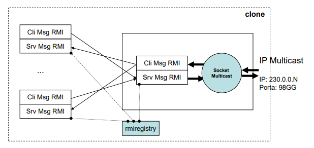
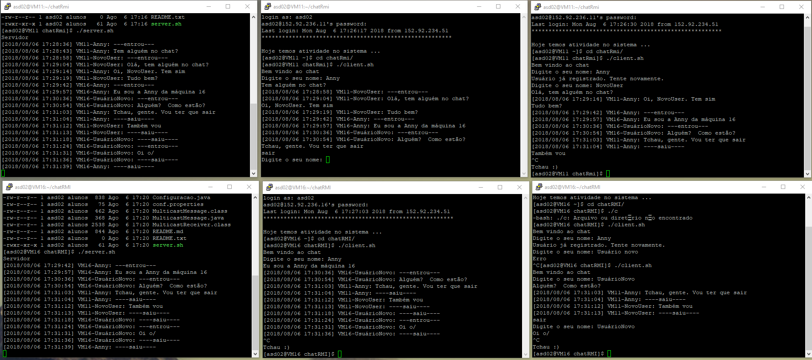

# Chat-Multicast

[vídeo do chat em funcionamento](https://youtu.be/EHZppP90ZmQ)

# Links
- [Exemplo Aplicação Java RMI](https://www.youtube.com/watch?v=tLtTWY6JqNo)
- [Java Tip 40: Object transport via datagram packets](https://www.javaworld.com/article/2077539/learn-java/java-tip-40--object-transport-via-datagram-packets.html)
- [Broadcasting and Multicasting in Java](http://www.baeldung.com/java-broadcast-multicast)
- [Uma introdução ao RMI em Java](https://www.devmedia.com.br/uma-introducao-ao-rmi-em-java/28681)
- [JVM Shutdown Hook in Java](https://www.geeksforgeeks.org/jvm-shutdown-hook-java/)
- [Utilizando arquivos de propriedades no Java](https://www.devmedia.com.br/utilizando-arquivos-de-propriedades-no-java/25546)
- [How to execute shell command from Java](https://www.mkyong.com/java/how-to-execute-shell-command-from-java/)
