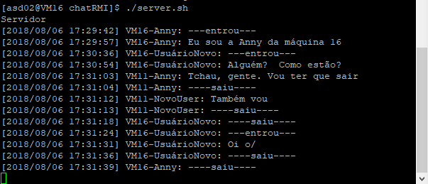
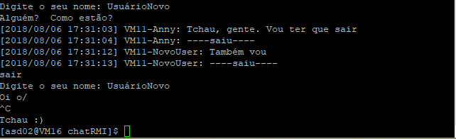

# Documentação da lista de graduação - 2018.1


## A arquitetura

A arquitetura escolhida foi a que utiliza socket UDT multicast (com um número IP classe D igual a 230.0.0.02) para comunicação entre servidores, e RMI para a comunicação entre servidores e clientes por meio da porta 9902. Vale citar que essas configurações podem ser alteradas por meio do arquivo conf.properties.

## Links importantes:
- [Enunciado](http://152.92.236.11/~asd02/assets/sd-20172-l1-grad.pdf)
- [Vídeo do chat em funcionamento](https://www.youtube.com/watch?v=cZYR-r8cv8Q&feature=youtu.be)
- [Site com a documentação](http://152.92.236.11/~asd02/)

## Chat em funcionamento


## Scripts de execução
### Execução do cliente
```
./client.sh
```
O script simplesmente executa a aplicação cliente usando java ChatClient
### Execução do servidor 
```
./server.sh
```
Na linha ```rmiregistry 9902 &```, o script cria e inicia, em background, um registro de objeto remoto na porta 9902 no host atual. Depois, executa a aplicação servidora e, por fim, mata o processo criado pelo ```rmiregistry```. O parâmetro ```-u``` especifica o usuário do processo que deve ser matado.
```
rmiregistry 9902 &
java ChatServer
pkill -u asd02 rmiregistry
```

## Funcionamento
O servidor imprime todas as mensagens recebidas juntamente com o nome do usuário e o hostname de que a enviou, e a data e hora do envio. Exibe, também, quando um usuário entra ou sai do chat. 
;

O cliente primeiramente requisita o nome do usuário e, se esse nome for único, permite que ele comece a enviar mensagens. O usuário pode se desconectar do chat enviando a mensagem "sair" ou fechar completamente o cliente clicando Ctrl+C. Vale citar que, como o nome do usuário é usado no Naming.bind, ele não pode conter espaços em branco. 

;

## Bibliografia
- [Exemplo Aplicação Java RMI](https://www.youtube.com/watch?v=tLtTWY6JqNo)
- [Java Tip 40: Object transport via datagram packets](https://www.javaworld.com/article/2077539/learn-java/java-tip-40--object-transport-via-datagram-packets.html)
- [Broadcasting and Multicasting in Java](http://www.baeldung.com/java-broadcast-multicast)
- [Uma introdução ao RMI em Java](https://www.devmedia.com.br/uma-introducao-ao-rmi-em-java/28681)
- [JVM Shutdown Hook in Java](https://www.geeksforgeeks.org/jvm-shutdown-hook-java/)
- [Utilizando arquivos de propriedades no Java](https://www.devmedia.com.br/utilizando-arquivos-de-propriedades-no-java/25546)